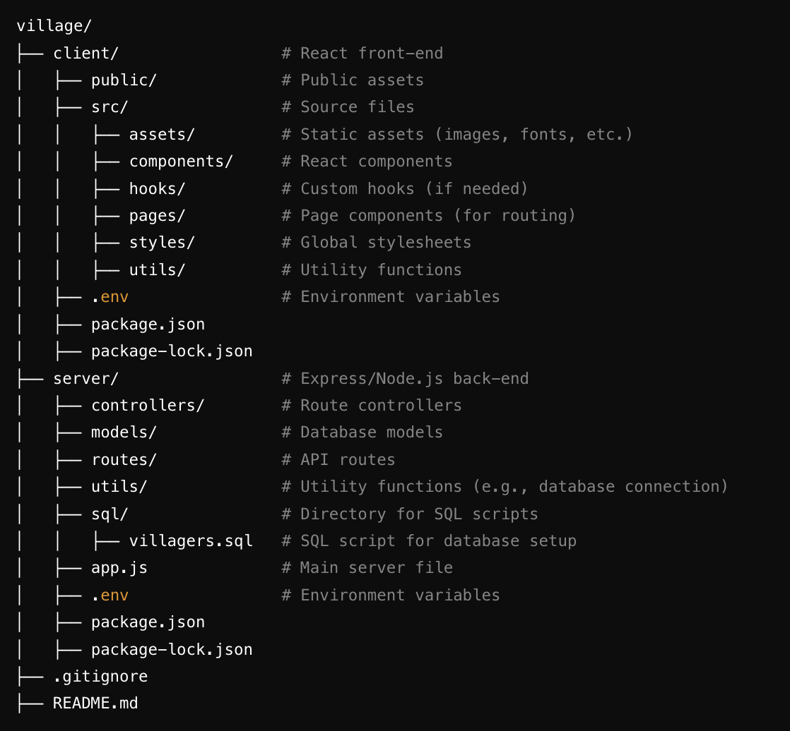

# Village - Group Project

## Setting up the project
(rough notes)

- git clone from repo
- copy of .env.example save as '.env' and update with personal details
- run `npm install`
- run `npm start`

## Project Directory Tree

